JAAS: Candid ADFS Integration
=============================

Introduction
------------

This how-to will teach you how to set up an AFDS identity provider for Candid.

Prerequisites
-------------

For this tutorial you will need the following:

- A valid registered domain (regardless of the registrar)
- AWS credentials
- Basic knowledge of juju
- A subdomain registered with Route 53. To learn how to set that up, please follow :doc:`route53`.

Candid
------

The first we need to deploy is Candid, so let’s begin by creating a model for Candid:

``juju add-model candid``

To deploy Candid please download  this `tarball <https://drive.google.com/file/d/1ZyZeI0jNacbXK-AgxzUT0IUEp9tQ85QH/view?usp=sharing>`_, which contains everything you will need. 
Extract the tarball:

``tar xvf candid_v1.11.0.tar.xz``

Now you can move to the extracted candid folder:
``cd candid``

and deploy the bundle. We will be using certbot to obtain valid certificates so we can use the following command:

``juju deploy  ./bundle.yaml --overlay ./overlay-certbot.yaml``

and wait for the deployment to finish. You can observe the deployment status by running;

``juju status --watch 2s –color``

Once the deployment is finished, you will see the certbot and haproxy units are in an error state. This is because we still need to obtain a valid certificate for Candid. First we will need to get the public IP of the haproxy/0 unit:

``juju status  --format json | jq '.applications.haproxy.units["haproxy/0"]["public-address"]'``

Now you will need to go to the `Route 53 dashboard <https://us-east-1.console.aws.amazon.com/route53/v2/home#Dashboard>`_, navigate to the hosted zone for the canonical.<domain.com> subdomain and select Create record. We will add an A record for candid.canonical.<domain.com> with the value of the IP of the haproxy/0 unit we obtained in the previous step.
To obtain a valid certificate for Candid we will use an action of the certbot charm. Run:

``juju run-action --wait certbot/0 get-certificate  agree-tos=true aws-access-key-id=<access key id> aws-secret-access-key=<secret access key> domains=candid.canonical.<domain.com> email=<your email>  plugin=dns-route53``

It might take a while (5 minutes+ is normal) to get the certificate, but once complete:

``juju status``

should show all units in an operational state.
Next we need to configure Candid. First we set the location configuration parameter:

``juju config candid location=https://candid.canonical.<domain.com>``
which will tell Candid which DNS it is running on. 

Azure
-----

Usually you will already have a tenant set up in Azure Active Directory, but for the sake of 
completeness, this howto will guide you through the process of setting one up.
Open your web browser and navigate to the `Azure Portal <https://portal.azure.com/>`_.
Search for `Azure Active Directory` and click on Manage tenants and then click on Create. You 
will be presented with the following form:

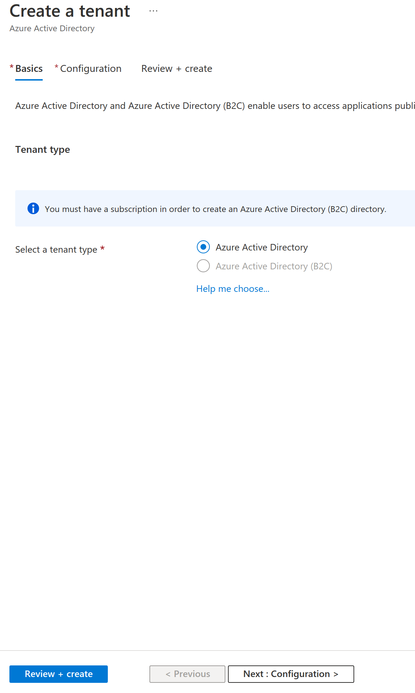

Select `Azure Active Directory` and click on `Next: Configuration`, which will show you the 
following form:

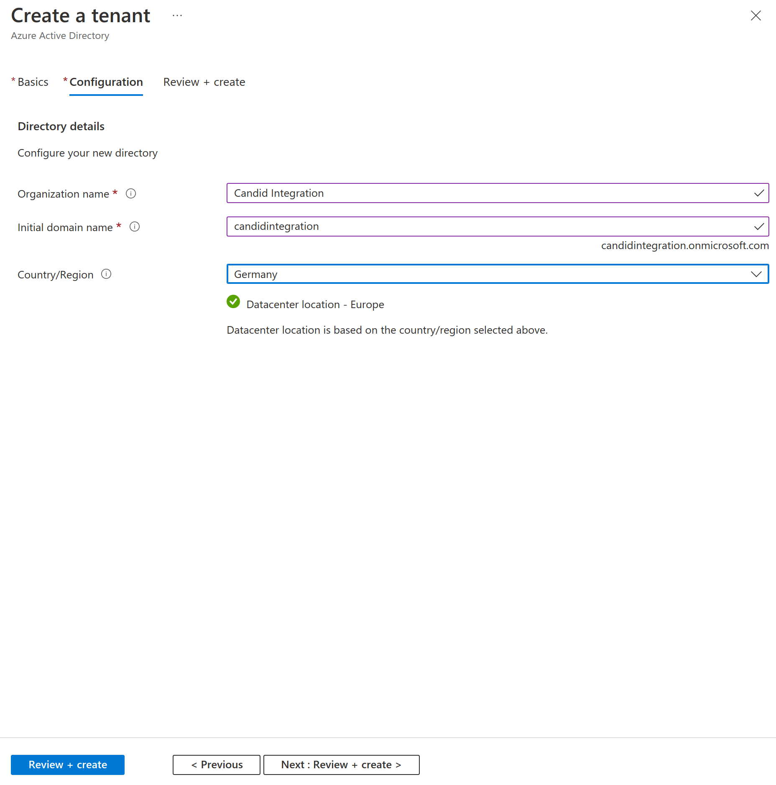

Enter the desired `Organization name`, `Initial domain name` (record this value as we will need 
it to configure Candid) and select an appropriate Country/Region, then click Review + create, 
which will show you the review form:

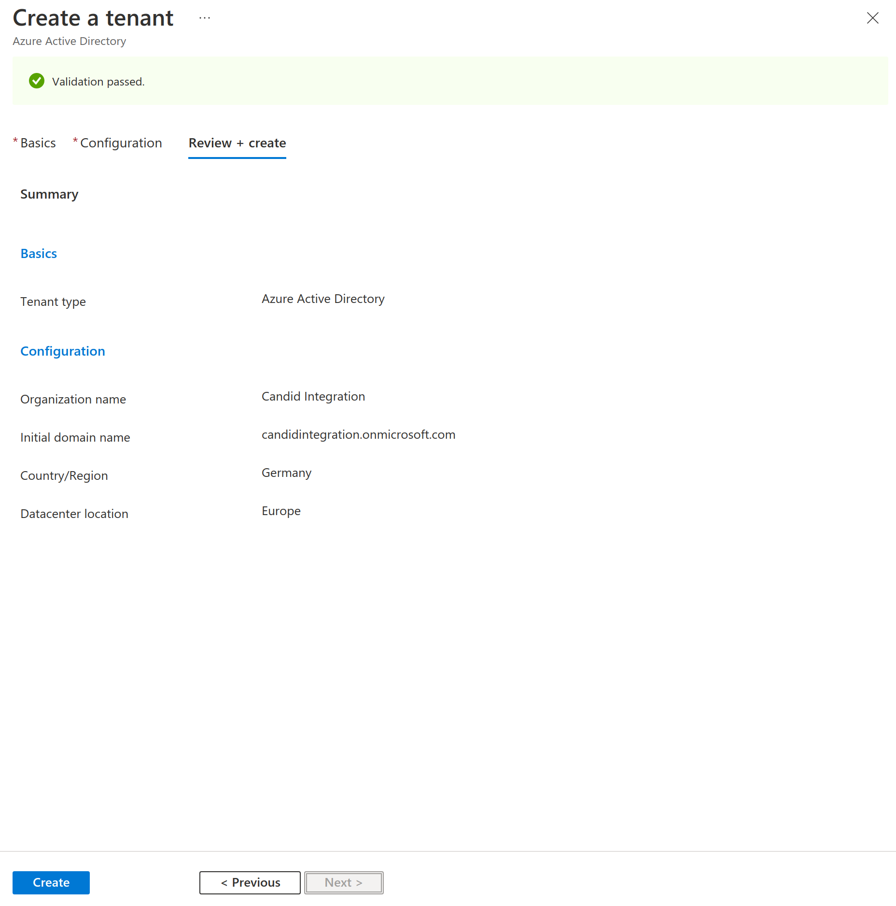

If you’re satisfied with the entered data, click `Create`. You will be presented with a form 
displaying information about the created tenant. Record the `Tenant ID`, as you will need it 
later when configuring Candid.

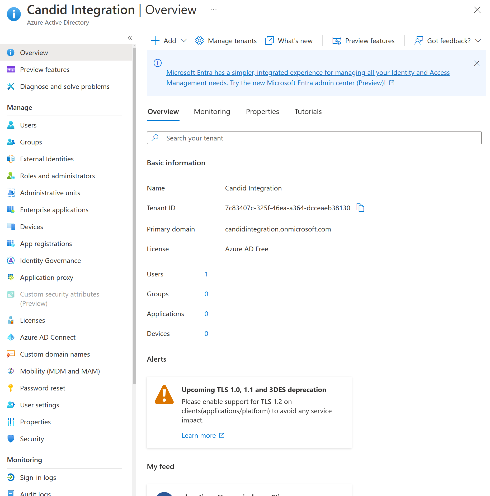

To create a new user click on `Users` and then `New user` which will present you with the 
following form where you can enter information about the new user.

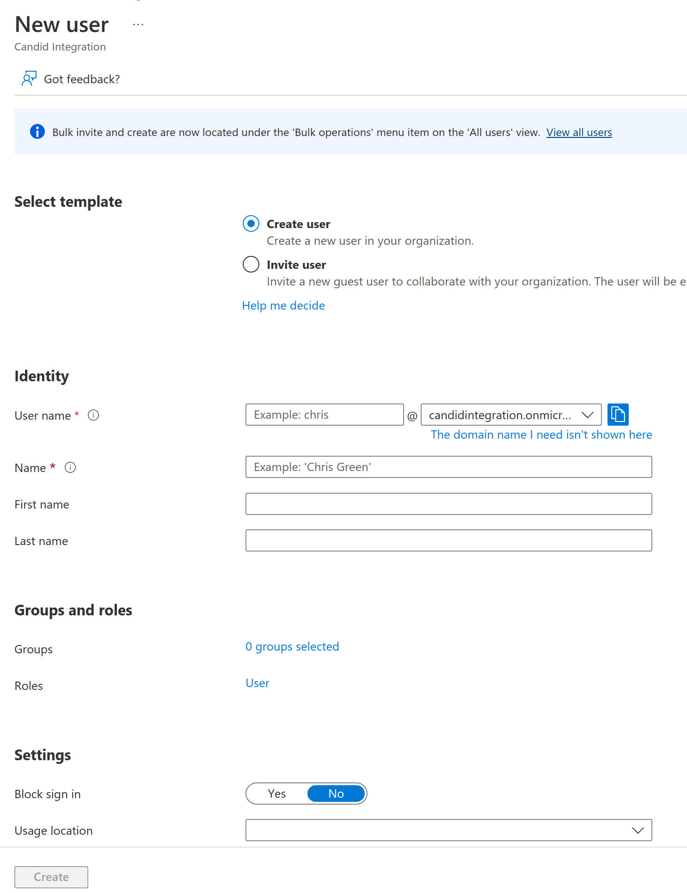

Next we want to create a few groups, so select `Groups` from the left hand side menu and 
create groups by clicking `New group` and entering relevant information. Created groups will 
be displayed as shown in the following form:

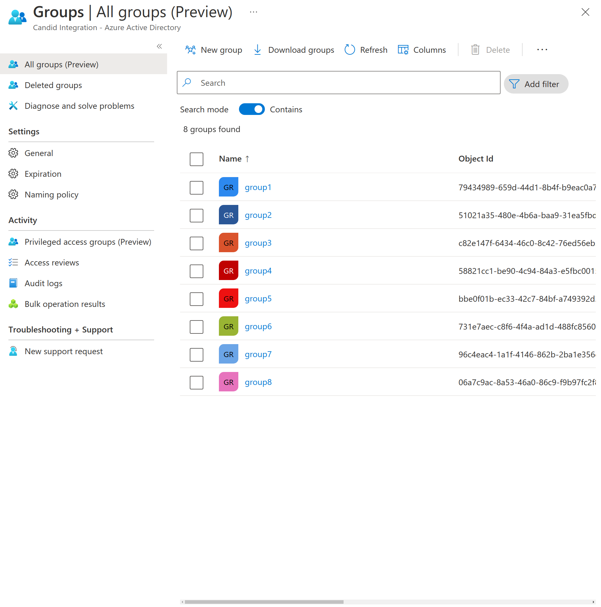

To make the new user member of any of these groups, click on the group name, then click on 
`Members` and then `Add members`. Start typing in the username and the portal should list 
users matching the entered username. Select the newly created user and click `Select` as shown
in the following form:

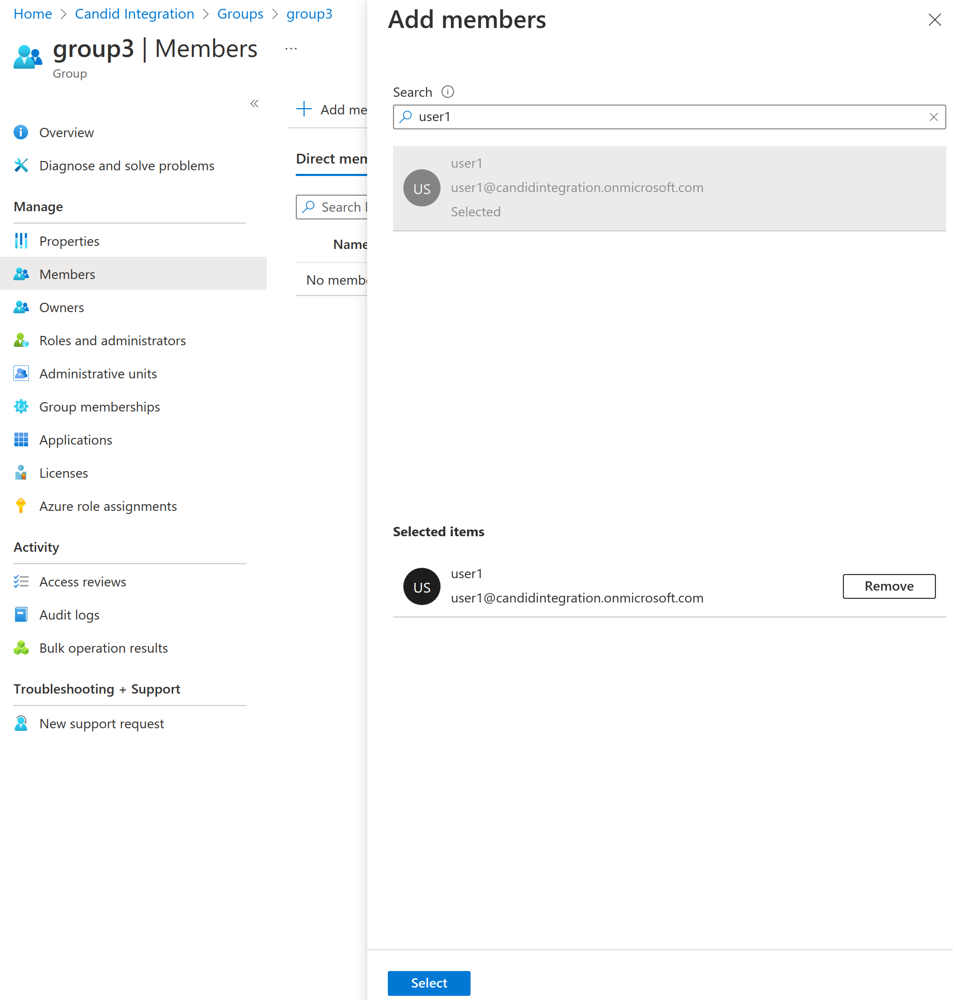

Once you have finished creating groups and users it is time to register an application. Return 
to the tenant overview form and click `App registrations`. In the following form enter the 
application name, select `Accounts in this organizational directory only (Single tenant)` and 
for the `Redirect URI` select `Web` and enter `https://<candid dns>/login/adfs/callback` as 
the redirect URI. 

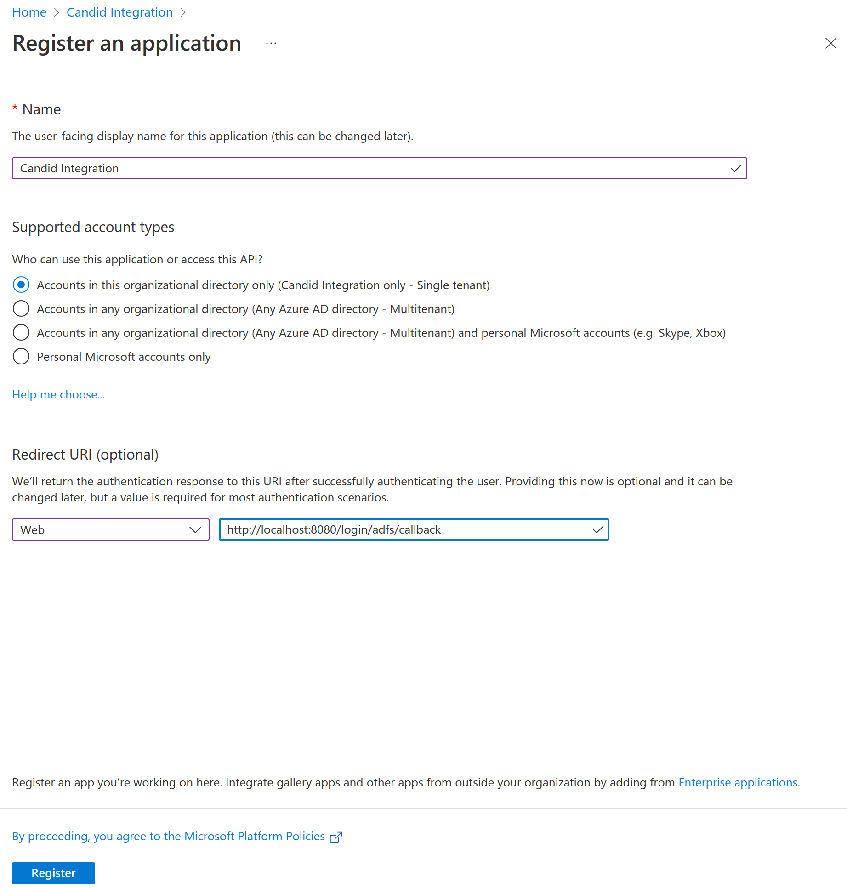

When you click `Register` you will be shown a form displaying data about the registered 
application. Record the `Application (client) ID` as you will need it later when configuring 
Candid.

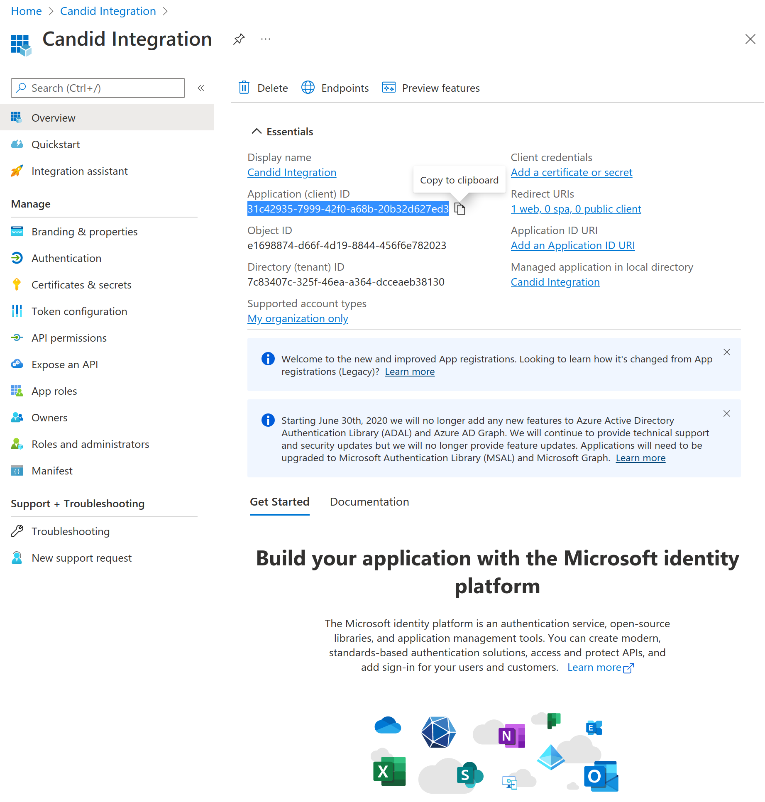

To give Candid access, we need to create a secret it will use to authenticate. Click on
`Certificates & secrets` and then `New client secret`. 

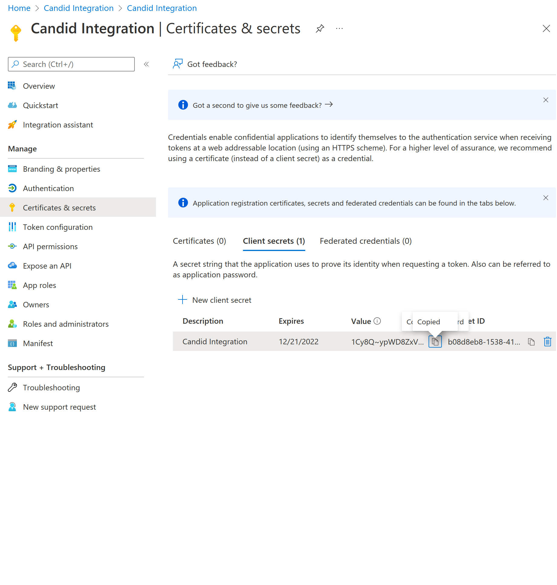

Record the displayed secret Value.

To give Candid permission to read user groups navigate to `API Permissions` and add permissions 
under `Microsoft Graph: Group.Read.All`.

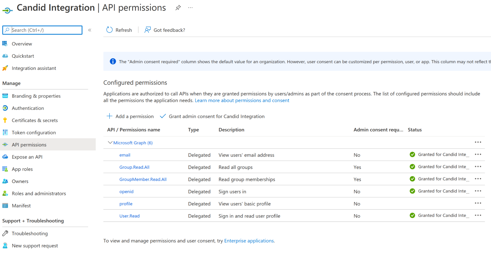

Then go to `Token configuration` to add additional claims. Click on `Add groups claim` so that 
the Azure callback will include additional groups(s) claim.

Configuring Candid
------------------

Next we need to add Azure as an identity provider to Candid, with the application (client) id 
and the client secret we created in the previous step. Run:

.. code-block:: bash

  juju config candid identity-providers='- type: adfs
    domain: <domain name>.onmicrosoft.com                                                 
    url: https://login.microsoftonline.com/<tenant id>/v2.0
    client-id: <client id>
    client-secret: <client secret>
    match-email-addr: "@<domain name>.onmicrosoft.com$"'

For the domain name enter the `Initial domain name` you entered when creating the new tenant. And 
the tenant id is the ID of the created tenant. For the client-id enter the `Application (client) ID`
you recorded when registering a new application. The client-secret is the Value you recorded when 
creating a new client secret for the registered application. 

Then we can test Candid by opening your browser and going to 
https://candid.canonical.<domain.com>/login, which will present you with a page allowing you to 
login with ADFS.

.. image:: images/adfs_image7.png

After you select ADFS identity provider you will have to log in with Azure and then Candid will 
present you with a page allowing you to register a new user by specifying the username. 

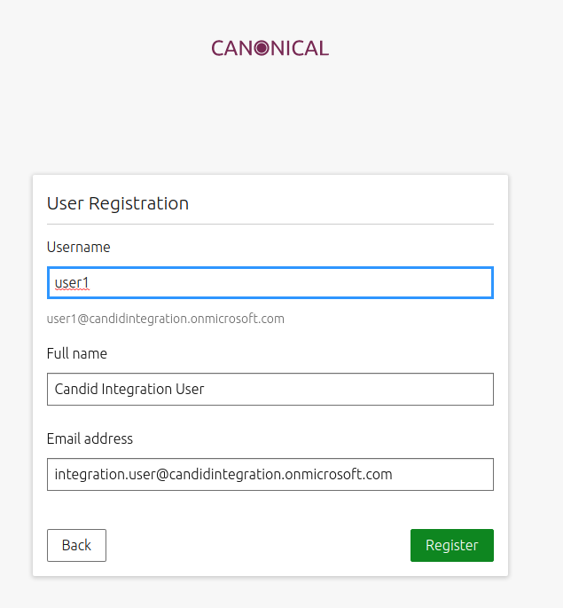

After you click Register, Candid will show a page notifying you that you have successfully logged 
in.

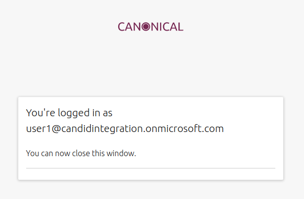

Conclusion
----------

In this how-to we have successfully deployed Candid and configured it to let you log in with your 
ADFS credentials.

To teardown your model and controller use the following command. 
This will free all resources created on the cloud provider used.

``juju destroy-controller --destroy-all-models --destroy-storage mycontroller``

