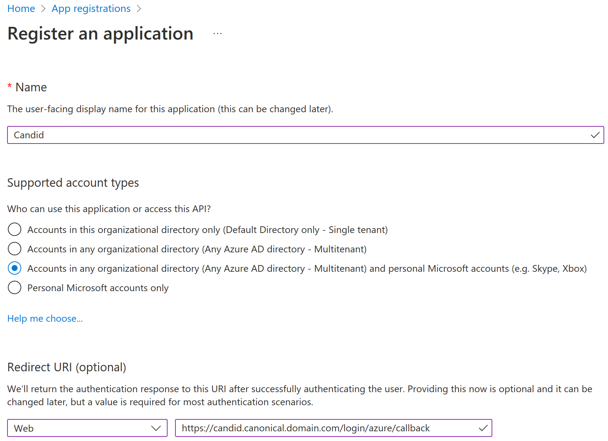
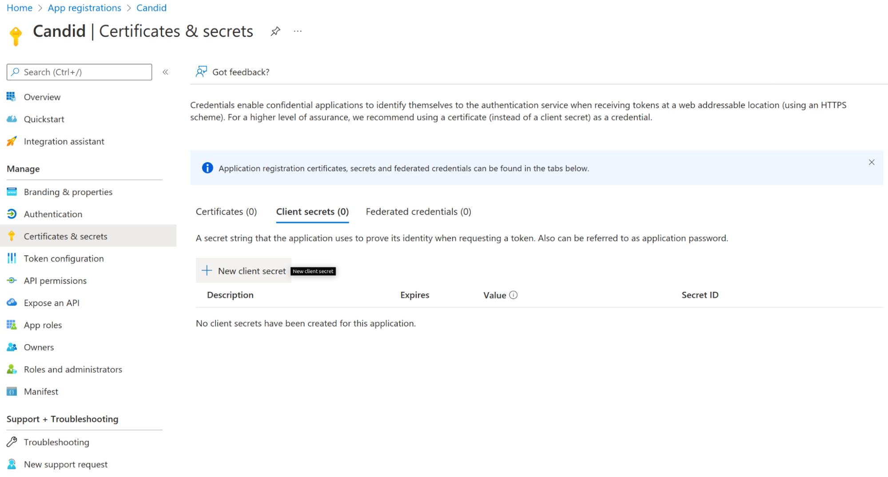
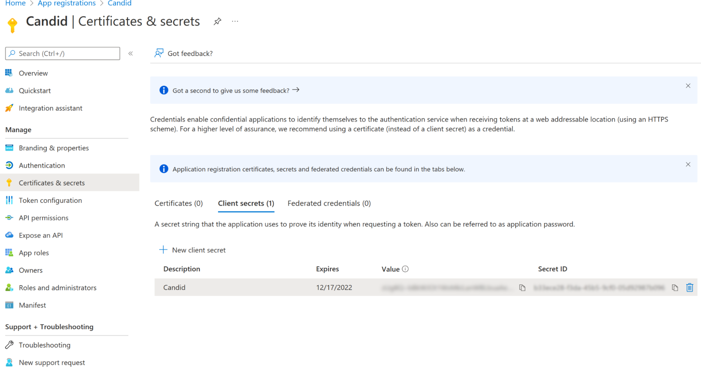
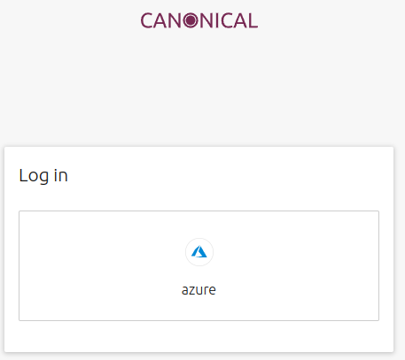
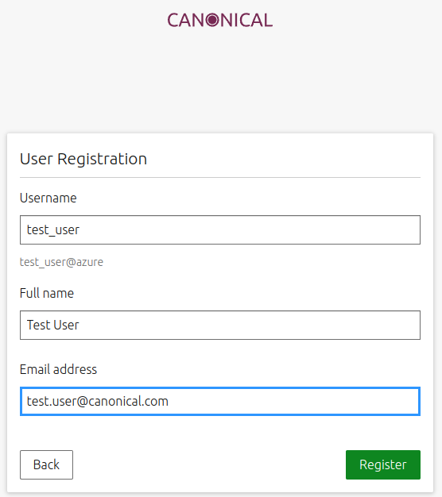

JAAS: Candid Azure Integration
==============================

Introduction
------------

This how-to will teach you how to set up an Azure identity provider for Candid.

Prerequisites
-------------

For this tutorial you will need the following:

- A valid registered domain (regardless of the registrar)
- AWS credentials
- Basic knowledge of juju
- A subdomain registered with Route 53. To learn how to set that up, please follow :doc:`route53`.

Candid
------

The first we need to deploy is Candid, so let’s begin by creating a model for Candid:

``juju add-model candid``

To deploy Candid please download  this `tarball <https://drive.google.com/file/d/1ZyZeI0jNacbXK-AgxzUT0IUEp9tQ85QH/view?usp=sharing>`_, which contains everything you will need. 
Extract the tarball:

``tar xvf candid_v1.11.0.tar.xz``

Now you can move to the extracted candid folder:
``cd candid``

and deploy the bundle. We will be using certbot to obtain valid certificates so we can use the following command:

``juju deploy  ./bundle.yaml --overlay ./overlay-certbot.yaml``

and wait for the deployment to finish. You can observe the deployment status by running;

``juju status --watch 2s –color``

Once the deployment is finished, you will see the certbot and haproxy units are in an error state. This is because we still need to obtain a valid certificate for Candid. First we will need to get the public IP of the haproxy/0 unit:

``juju status  --format json | jq '.applications.haproxy.units["haproxy/0"]["public-address"]'``

Now you will need to go to the `Route 53 dashboard <https://us-east-1.console.aws.amazon.com/route53/v2/home#Dashboard>`_, navigate to the hosted zone for the canonical.<domain.com> subdomain and select Create record. We will add an A record for candid.canonical.<domain.com> with the value of the IP of the haproxy/0 unit we obtained in the previous step.
To obtain a valid certificate for Candid we will use an action of the certbot charm. Run:

``juju run-action --wait certbot/0 get-certificate  agree-tos=true aws-access-key-id=<access key id> aws-secret-access-key=<secret access key> domains=candid.canonical.<domain.com> email=<your email>  plugin=dns-route53``

It might take a while (5 minutes+ is normal) to get the certificate, but once complete:

``juju status``

should show all units in an operational state.
Next we need to configure Candid. First we set the location configuration parameter:

``juju config candid location=https://candid.canonical.<domain.com>``
which will tell Candid which DNS it is running on. 

Azure
-----

With Candid deploy, we need credentials that will let Candid user Azure.
To do that open your browser and go to the Azure portal Find App Registration as we need to register a new application. The Azure portal will show you the following screen:

where you will enter the application name and choose “Accounts in any organizational directory (Any Azure AD directory - Multitenant) and personal Microsoft accounts (e.g. Skype, Xbox)” when specifying who can access this API.
for the Redirect URI choose “Web” and enter “https://candid.canonical.<domain.com>/login/azure/callback” as the callback URI.
After clicking “Register” you will be taken to the App Registration page, where you will find the “Application (client) ID”, which you need to copy. Then select “Certificates & secrets” in the management menu, because we will need to create a new secret.

When you select “New client secret” it will prompt you to enter a name for it and then it will show you a page displaying the created secret value and ID. Copy the secret value as we will need it when configuring Candid.
 

Configuring Candid
------------------

Next we need to add Azure as an identity provider to Candid, with the application (client) id and the client secret we created in the previous step. Run:

.. code:: console

    juju config candid identity-providers='- type: azure                                                   
    client-id: <client id>
    client-secret: <client secret>

Then we can test Candid by opening your browser and going to “https://candid.canonical.<domain.com>/login”, which will present you with a page allowing you to login with Azure.

After you select Azure identity provider you will have to log in with Azure and then Candid will present you with a page allowing you to register a new user by specifying the username. 

After you click Register, Candid will show a page notifying you that you have successfully logged in.

Conclusion
----------

In this how-to we have successfully deployed Candid and configured it to let you log in with your Azure credentials.

