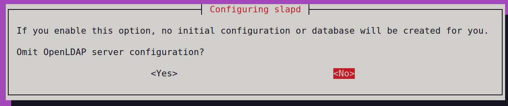
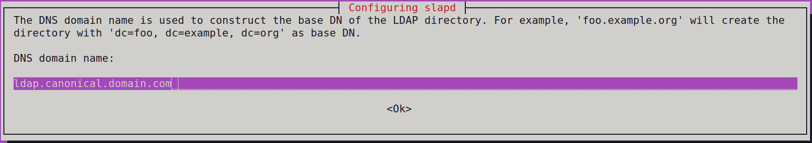
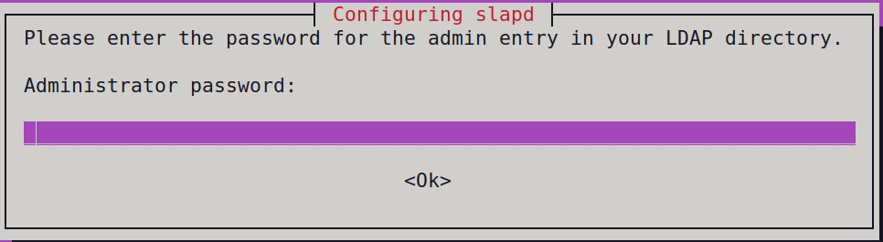
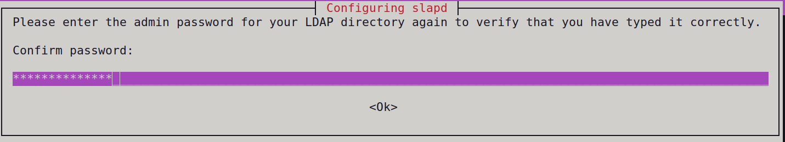
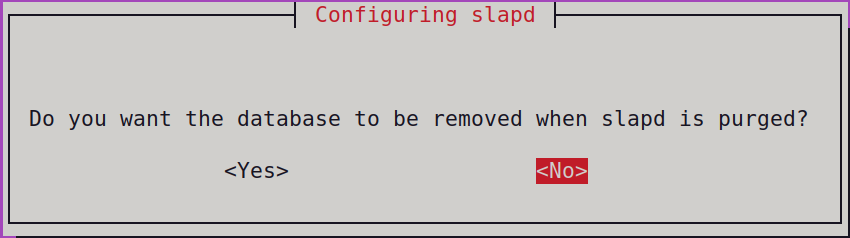
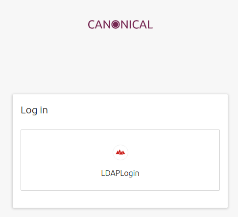
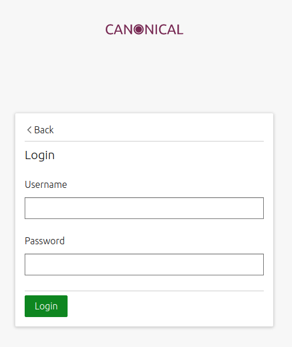

JAAS: Candid LDAP Integration
=============================

Introduction
------------

This how-to will teach you how to set up an LDAP identity provider for Candid.

Prerequisites
-------------

For this tutorial you will need the following:

- A valid registered domain (regardless of the registrar)
- AWS credentials
- Basic knowledge of juju
- A subdomain registered with Route 53. To learn how to set that up, please follow :doc:`route53`.

Candid
------

The first we need to deploy is Candid, so let’s begin by creating a model for Candid:

``juju add-model candid``

To deploy Candid please download  this `tarball <https://drive.google.com/file/d/1ZyZeI0jNacbXK-AgxzUT0IUEp9tQ85QH/view?usp=sharing>`_, which contains everything you will need. 
Extract the tarball:

``tar xvf candid_v1.11.0.tar.xz``

Now you can move to the extracted candid folder:
``cd candid``

and deploy the bundle. We will be using certbot to obtain valid certificates so we can use the following command:

``juju deploy  ./bundle.yaml --overlay ./overlay-certbot.yaml``

and wait for the deployment to finish. You can observe the deployment status by running;

``juju status --watch 2s –color``

Once the deployment is finished, you will see the certbot and haproxy units are in an error state. This is because we still need to obtain a valid certificate for Candid. First we will need to get the public IP of the haproxy/0 unit:

``juju status  --format json | jq '.applications.haproxy.units["haproxy/0"]["public-address"]'``

Now you will need to go to the `Route 53 dashboard <https://us-east-1.console.aws.amazon.com/route53/v2/home#Dashboard>`_, navigate to the hosted zone for the canonical.<domain.com> subdomain and select Create record. We will add an A record for candid.canonical.<domain.com> with the value of the IP of the haproxy/0 unit we obtained in the previous step.
To obtain a valid certificate for Candid we will use an action of the certbot charm. Run:

``juju run-action --wait certbot/0 get-certificate  agree-tos=true aws-access-key-id=<access key id> aws-secret-access-key=<secret access key> domains=candid.canonical.<domain.com> email=<your email>  plugin=dns-route53``

It might take a while (5 minutes+ is normal) to get the certificate, but once complete:

``juju status``

should show all units in an operational state.
Next we need to configure Candid. First we set the location configuration parameter:

``juju config candid location=https://candid.canonical.<domain.com>``
which will tell Candid which DNS it is running on. 

LDAP
----

In real-world scenarios you will already have a LDAP deploy, which you will use with candid. But for the sake of completeness this section will show you how to manually deploy and configure OpenLDAP (deploy using charms will be described in a separate document as we currently do not have an OpenLDAP machine charm).
First we create a model for the LDAP deploy:

``juju add-model ldap``

Then we deploy a basic Ubuntu unit and a certbot charm:

.. code::

    juju deploy ubuntu ldap
    juju deploy cs:~yellow/certbot

and wait for the units to deploy.

Install OpenLDAP
~~~~~~~~~~~~~~~~

As stated above, we will manually deploy OpenLDAP as we currently do not have a machine charm for it.
SSH into the unit:
 
``juju ssh ldap/0``

And install OpenLDAP by running:

``sudo apt install slapd ldap-utils``

Having installed OpenLDAP run:

``sudo dpkg-reconfigure slapd``

Which will take you through the process of reconfiguring OpenLDAP.
First, you will be presented with the following screen.

Answer “No”.
When asked to enter then DNS domain name

enter “ldap.canonical.<domain.com>” replacing the “<domain.com>” part with the name of the domain you own.

In the next screen enter “canonical.<domain.com>” as the name of the organization again, replacing “domain.com” with the domain you own.

.. image:: images/ldap_image3.png

Next you will have to enter an administrator password.

And re-enter the chosen administrator password.

When asked if you want the database removed when slapd is purged, it is safe to answer “No.” as this is there is no content in the database yet.

Having configured OpenLDAP you can exit from the unit.

Configure TLS
~~~~~~~~~~~~~

To obtain a valid certificate for OpenLDAP we will use certbot.
First we need to tell certbot where to place obtained certificate, key and trust chain:

.. code:: console

    juju config certbot chain-path=/etc/ldap/ldap-chain.pem
    juju config certbot key-path=/etc/ldap/ldap-key.pem
    juju config certbot cert-path=/etc/ldap/ldap-cert.pem

Now we can add a relation between certbot and ldap applications:

``juju add-relation certbot ldap``

Next we’ll need to create a DNS **A** record for the LDAP in Route53.
Run:

``juju status  --format json | jq '.applications.ldap.units["ldap/0"]["public-address"]'``

to obtain the public IP of the LDAP unit and use that IP to create an **A** record for the DNS ldap.canonical.<domain.com>.
Then we can run the get-certificate action on the certbot unit to obtain certificates;

``juju run-action –wait certbot/0 get-certificate agree-tos=true aws-access-key-id=<aws-secret-access-key-id> aws-secret-access-key=<aws-secret-access-key> domains=ldap.canonical.<domain.com> email=<your email> plugin=dns-route53``

This will result in creation of .pem files specified by the certbot configuration.
Now we can ssh back into the ldap unit:

.. code:: console

    juju ssh ldap/0
    cd /etc/ldap

Next we need to configure OpenLDAP to use created certificates.
We do that by creating a file certinfo.ldif with the following content

.. code:: yaml

    dn: cn=config
    replace: olcTLSCACertificateFile
    olcTLSCACertificateFile: /etc/ldap/ldap-chain.pem
    -
    replace: olcTLSCertificateFile
    olcTLSCertificateFile: /etc/ldap/ldap-cert.pem
    -
    replace: olcTLSCertificateKeyFile
    olcTLSCertificateKeyFile: /etc/ldap/ldap-key.pem

And then apply this configuration to OpenLDAP:

``sudo ldapmodify -Y EXTERNAL -H ldapi:/// -f certinfo.ldif``

Allowing access to LDAP
~~~~~~~~~~~~~~~~~~~~~~~

As we have manually deployed OpenLDAP, we need to allow access to its ports. To do that go to the EC2 management console, to the list of running instances. Identify the OpenLDAP unit by its IP and edit its security groups. Add a rule that allows access to the LDAP port (389) from anywhere on the web.

Initial LDAP content
~~~~~~~~~~~~~~~~~~~~

Next we create a file content.ldif with the following content:

.. code:: yaml

    dn: ou=People,dc=canonical,dc=<domain>,dc=<com>
    objectClass: organizationalUnit
    ou: People

    dn: ou=Groups,dc=canonical,dc=<domain>,dc=<com>
    objectClass: organizationalUnit
    ou: Groups

And add that to OpenLDAP:

``ldapadd -x -D cn=admin,dc=canonical,dc=<domain>,dc=<com> -W -f ./content.ldif``
    
Adding users
~~~~~~~~~~~~

To add an LDAP user, we create a file names <username>.ldif with the following content:

.. code:: yaml 

    dn: uid=<username>,ou=People,dc=canonical,dc=<domain>,dc=<com>
    objectClass: inetOrgPerson
    objectClass: posixAccount
    objectClass: shadowAccount
    uid: <username>
    sn: <serial number>
    givenName: <name>
    cn: <username>
    displayName: <display name>
    uidNumber: <uuid number e.g. 10000>
    gidNumber: <gid number e.g. 5000>
    userPassword: {CRYPT}x
    gecos: <display name>
    loginShell: /bin/bash
    homeDirectory: /home/<username>

And use ldapadd to add the user:

``ldapadd -x -D cn=admin,dc=canonical,dc=<domain>,dc=<com> -W -f ./<username>.ldif``

Next we need to set a password for the created user, which we do by running: 

``ldappasswd -x -D cn=admin,dc=canonical,dc=<domain>,dc=<com> -W -S uid=<username>,ou=People,dc=canonical,dc=<domain>,dc=<com>``

LDAP Identity Provider for Candid
---------------------------------

Once we have Candid deployed and LDAP configured all we need to do is let Candid know how to use OpenLDAP as an identity provider. We do this by setting its identity-providers config option:

.. code:: console

    juju config candid identity-providers='- type: ldap                                              
    name: <name of your LDAP>  
    description: <short description of you LDAP>
    domain: ldap.canonical.<domain.com>
    url: ldap://ldap.canonical.<domain.com>/dc=canonical,dc=<domain>,dc=<com>
    dn: cn=admin,dc=canonical,dc=<domain>,dc=<com>
    password: <admin password for LDAP>
    user-query-filter: (objectClass=inetOrgPerson)
    user-query-attrs:
        id: uid
        email: mail
        display-name: displayName
    group-query-filter: (&(objectClass=groupOfNames)(member={{.User}}))
    hidden: false
    ca-cert: |
        <LDAP’s CA certificate, which is the contents of /etc/ldap/ldap-chain.pem in the ldap unit>

Testing Candid with LDAP
------------------------

To test Candid you can open your browser and go to https://candid.canonical.<domain.com>/login which will present you with the following page:

as we only have one identity provider configured - LDAP. Clicking on ldap will present you with the following page:

where you are asked to provide username and password for one of the users you added to LDAP. If you enter the correct credentials, Candid will show you a page notifying you that you have successfully logged in.

Conclusion
----------

In this how-to we have successfully deployed Candid and OpenLDAP and configured Candid to let you log in with your OpenLDAP credentials.

