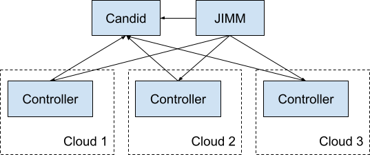

JAAS Basics
===========

Introduction
------------

JAAS provides a single location to manage your Juju infrastructure by using the Dashboard or using 
the Juju CLI commands to create a high-level overview and the ability to drill-in to the details 
when you need it.

JAAS is composed of the following components:

- Candid - macaroon-based authentication server, which is required so that all other components are able to agree who a particular user is,
- JIMM - Juju Intelligent Model Manager, which acts as a single point of contact for multiple Juju controllers
- Multiple Juju controllers, each controlling models in specific clouds or cloud regions.
 

In this tutorial we will show you how to deploy all components of JAAS and how to use it to deploy 
a workload.

Prerequisites
-------------

For this tutorial you will need the following:

- Have valid AWS credentials you can use
- Have basic knowledge of Juju and are able to use the Juju CLI
- Have AWS credentials Juju can use to deploy in EC2 (see instructions here)
- Own a domain name (e.g. domain.com) 
- Have set up subdomain (canonical.domain.com) that is managed by Route 53 (see :doc:`../how-to/route53`). Please replace canonical.domain.com in the rest of this tutorial with the actual subdomain you have set up with Route 53.

Deploy
------

We will be deploying all the components of JAAS in AWS since you already have credentials that 
allow Juju to deploy workloads in AWS.

First, let’s bootstrap a Juju controller in AWS:

``juju bootstrap aws/eu-central-1 infrastructure``

This will create a controller called infrastructure that will control the models into which we 
will deploy Candid and JIMM.  The process might take a while.

Candid
------

The first component we need to deploy is Candid, so let’s begin by creating a model for Candid: 

``juju add-model candid``

To deploy Candid please download  this `tarball <https://drive.google.com/file/d/1ZyZeI0jNacbXK-AgxzUT0IUEp9tQ85QH/view?usp=sharing>`_, 
which contains everything you will need. 

Extract the tarball:

``tar xvf candid_v1.11.0.tar.xz``

Now you can move to the extracted candid folder:

``cd candid``

and deploy the bundle. We will be using certbot to obtain valid certificates so we can use the 
following command:

``juju deploy  ./bundle.yaml --overlay ./overlay-certbot.yaml``

and wait for the deployment to finish. You can observe the deployment status by running:

``juju status –watch 5s –color``

Once the deployment is finished, you will see the certbot and haproxy units are in an error state. 
This is because we still need to obtain a valid certificate for Candid. First we will need to get  
the public IP of the haproxy/0 unit:

``juju status  --format json | jq '.applications.haproxy.units["haproxy/0"]["public-address"]'``

Now you will need to go to the `Route 53 dashboard <https://us-east-1.console.aws.amazon.com/route53/v2/home#Dashboard>`_,
navigate to the hosted zone for the canonical.domain.com subdomain and select `Create record`. We 
will add an **A** record for candid.canonical.domain.com with the value of the IP of the haproxy/0 
unit we obtained in the previous step.

To obtain a valid certificate for Candid we will use an action of the certbot charm. Run:

``juju run-action --wait certbot/0 get-certificate  agree-tos=true aws-access-key-id=<access key id> aws-secret-access-key=<secret access key> domains=candid.canonical.domain.com email=<your email>  plugin=dns-route53``

It might take a while (5 minutes+ is normal) to get the certificate, but once complete:

``juju status``

should show all units in an operational state.

Next we need to configure Candid. First we set the location configuration parameter:

``juju config candid location=https://candid.canonical.domain.com``

which will tell Candid which DNS it is running on. 

Now all that is left is to set up the identity providers. In this tutorial we will set up a static 
identity provider with hard-coded usernames and passwords:

.. code:: console

    juju config candid identity-providers='- type: static                                       
    name: static      
    description: Default identity provider
    users:
        user1:
        name: User One
        email: user1
        password: s3cre7Pa55w0rd1
        groups:
        - group1
        user2:
        name: User Two
        email: user2
        password: s3cre7Pa55w0rd2
        groups:
        - group1'

As you can see we set up Candid to know about two users: user1 and user2 with corresponding 
passwords s3cre7Pa55w0rd1 and s3cre7Pa55w0rd2, which you will use to log in.

Now we have deployed Candid and we can verify if it is working by opening a browser and going to 
https://candid.canonical.domain.com/login and try logging in as either user1 or user2.

JIMM
----

Next we will be deploying JIMM, which will allow us to control multiple Juju controllers from a 
single point.

Let’s add a new Juju model for jimm:

``juju add-model jimm``

To deploy JIMM please download this tarball `<https://drive.google.com/file/d/19IFY7m-GW1AdKUzKdKbUO_bSE6zv8tNH/view?usp=sharing>`_ and extract it:

``tar xvf jimm.tar.xz``

and move to the extracted jimm folder:

``cd jimm``

We will be using certbot to obtain valid certificates so we can again use the following command:

``juju deploy  ./bundle.yaml --overlay ./overlay-certbot.yaml``

and wait for the deployment to finish. You can observe the deployment status by running:

``juju status -watch 2s``

Once the deployment is finished you will see that we have deployed 2 JIMM units, 2 postgresql units 
and one HAProxy unit. The HAProxy will act as a load balancer redirecting clients to one of the 
deployed JIMM units and both JIMM units will connect to the deployed postgresql cluster. We have 
also deployed the ntp charm which will make sure the clocks on all units are synchronized and the 
certbot charm, which is related to the HAProxy unit and we will use the certbot charm to obtain 
valid certificates.

For now, you will see the certbot and haproxy units are in an error state. This is because we 
still need to obtain a valid certificate for JIMM. First we will need to get the public IP of 
the haproxy/0 unit:

``juju status  --format json | jq '.applications.haproxy.units["haproxy/0"]["public-address"]'``

Now you will need to go to the `Route 53 dashboard <https://us-east-1.console.aws.amazon.com/route53/v2/home#Dashboard>`_, 
navigate to the hosted zone for the canonical.domain.com subdomain and select `Create record`. 
We will add an **A** record for jimm.canonical.domain.com with the value of the IP of the 
haproxy/0 unit we obtained in the previous step. 

To obtain a valid certificate for JIMM we will use an action of the certbot charm. Run:

``juju run-action --wait certbot/0 get-certificate  agree-tos=true aws-access-key-id=<access key id> aws-secret-access-key=<secret access key> domains=jimm.canonical.domain.com email=<your email>  plugin=dns-route53``

It might take a while to get the certificate, but once complete:

``juju status``

should show all units in an operational state.

Now we need to configure JIMM to use the Candid we deployed:

``juju config jimm candid-url=https://candid.canonical.domain.com``

And configure JIMM to use the DNS name we set up:

``juju config jimm dns-name=jimm.canonical.domain.com``

Then add user1 as JIMM administrator:

``juju config jimm controller-admins=user1``

We also need to give JIMM a new controller UUID, which it will use to identify itself against 
Juju clients. We can generate a random UUID, but for this tutorial we can use:

``juju config jimm uuid=d55701bf-04e4-4c67-b3ae-d43ec3c96fa7``

Now we have deployed JIMM and to verify that it is working properly you can try:

``juju login jimm.canonical.domain.com``

and log in as user1. From this point on we will be using JIMM which will act as a Juju controller.

Trying to list models will now show no models:

``juju models``

Now we will also configure JIMM to serve the Juju Dashboard. The tarball needed for that is 
included in the jimm.tar.xz that you have previously downloaded and is located in the dashboard 
folder. First switch to the jimm model:

``juju switch infrastructure:jimm``

then we need to attach the dashboard tarball as a resource to JIMM:

``juju attach-resource jimm dashboard=juju-dashboard-0.9.2.tar.bz2``

Before we can use JIMM though, we will need to add a controller to it. JIMM itself only forwards 
requests to appropriate Juju controllers but can not directly control a model.

Controller
----------

As stated above, we need to add a Juju controller to JIMM for each cloud (or cloud region) that we 
want to be able to deploy to. For the purpose of this tutorial we will add a single controller that
will let us deploy to AWS.

When bootstrapping a new Juju controller we will be defining some parameters that will tell the 
controller which identity service to use to authenticate users (the Candid we had previously 
deployed) and the DNS name for the server: 

``juju bootstrap --no-gui --bootstrap-constraints="root-disk=50G cores=8 mem=8G" --config identity-url=https://candid.canonical.domain.com --config allow-model-access=true --config public-dns-address=aws-1.canonical.domain.com:443 aws/eu-central-1 aws-1``

Please note that the constraints stated above are the ones used for production JAAS services and 
should be suitable for most loads. Feel free to set constraints appropriate to your system.

Next we put the controller into HA mode:

``juju enable-ha``

which deploys two additional units of the controller increasing the resilience of the system. 
Then you will need to switch to the controller model:

``juju switch controller`` 

You can ensure you’re on the correct controller and model via:

``juju whoami``

Download the controller tarball `<https://drive.google.com/file/d/17GHATHXGg2GuIeIWGr0FvkguMRdv5vnH/view?usp=sharing>`_ 
and extract it:

``tar xvf controller.tar.xz``

then move to the controller folder:

``cd controller``

and deploy the controller bundle:

``juju deploy --map-machines=existing ./bundle.yaml --overlay ./overlay-certbot.yaml``

Once the bundle is deployed you will again see that the haproxy and certbot units are in error 
state since we have not yet obtained a valid certificate for the deployed controller.

Run the following to obtain the public IP of the haproxy unit:

``juju status  --format json | jq '.applications.haproxy.units["haproxy/0"]["public-address"]'``

Now you will need to go to the Route 53 dashboard again, navigate to the hosted zone for the canonical.domain.com subdomain and select Create record. We will add an A record for aws-1.canonical.domain.com with the value of the IP of the haproxy/0 unit we obtained in the previous step.

To obtain a valid certificate for the new controller we will use an action of the certbot charm. 
Run:

``juju run-action --wait certbot/0 get-certificate  agree-tos=true aws-access-key-id=<access key id> aws-secret-access-key=<secret access key> domains=aws-1.canonical.domain.com email=<your email> plugin=dns-route53``

It might take a while to get the certificate, but once complete:

``juju status``

Once Juju status shows all Juju units as operational we can move to the next step, which is adding 
this controller to JIMM.

To achieve this, you will need to download and install the `JAAS snap <https://drive.google.com/file/d/1LiOvVpVQ13V3x3l2PhgS2fTHDUtCEe7p/view?usp=sharing>`_. To install the snap run:

``sudo snap install jaas_amd64.snap --dangerous``

Once you have installed the snap run:

``/snap/jaas/current/bin/jimmctl controller-info --public-address=aws-1.<your domain>:443 aws-1 aws-1.yaml``

to get the controller information in YAML format. Then to finally add the controller to JIMM 
switch to the JIMM controller:

``juju switch jimm.canonical.domain.com``

and run:

``/snap/jaas/current/bin/jimmctl add-controller aws-1.yaml``

To see the registered controller, head over to your domain in the browser:

``jimm.<your domain>``

And login using the credentials you provided the Candid earlier.

Since we configured JIMM so that user1 is an admin user, you have to log in as user1 to be able to 
add the controller. If needed, you can always run:

.. code:: console

    juju logout
    juju login jimm.canonical.domain.com

to re-login.

Workloads
---------

Now you have installed the JAAS system (Candid and JIMM) and added a controller to it, which means 
we can now use it to deploy our workloads.

Make sure we are using the JIMM controller, so just in case run:

``juju switch jimm.canonical.domain.com``

If we run:

``juju list-credentials``

we will see the JIMM controller lacks your AWS credentials, we can upload these credentials from 
your Juju client to the controller via:

``juju update-credentials aws --controller jimm.<your domain>``

Now let’s make this tutorial fun and deploy kubernetes using JAAS. First, we want to add a new 
model for our kubernetes deploy:

``juju add-model k8s``

Since we only have one controller in AWS, the new model will also be added in AWS. Juju makes 
it really easy to deploy kubernetes, run the following command: 

``juju deploy charmed-kubernetes``

and then we wait:

``juju status --wait 4s --color``

Once the deploy finishes that is it - we have a functioning kubernetes cluster. To start using it 
you will want to install the kubectl snap:

``sudo snap install kubectl --classic``

and fetch the config file from the newly deployed cluster:

``juju scp kubernetes-master/0:config ~/.kube/config``

You can verify everything is configured correctly and see the cluster by running:

``kubectl cluster-info``

To add simple storage for Kubernetes using NFS run:

.. code:: console

    juju deploy nfs --constraints root-disk=200G
    juju add-relation nfs kubernetes-worker

Dashboard
---------

Now you can open a browser and navigate to https://jimm.canonical.domain.com/dashboard 
where you will find the Juju Dashboard. Again you will be asked to log in: log in as user1. 
If you click on Models in the left pane, you will see the k8s model that we created for our 
kubernetes deploy. Click on k8s and you will see the entire kubernetes cluster as deployed 
by Juju. You can select individual applications to see details.

Conclusion
----------

Following this tutorial you have deployed the JAAS system and used it to deploy a simple 
kubernetes cluster that you can use to deploy further workloads.
